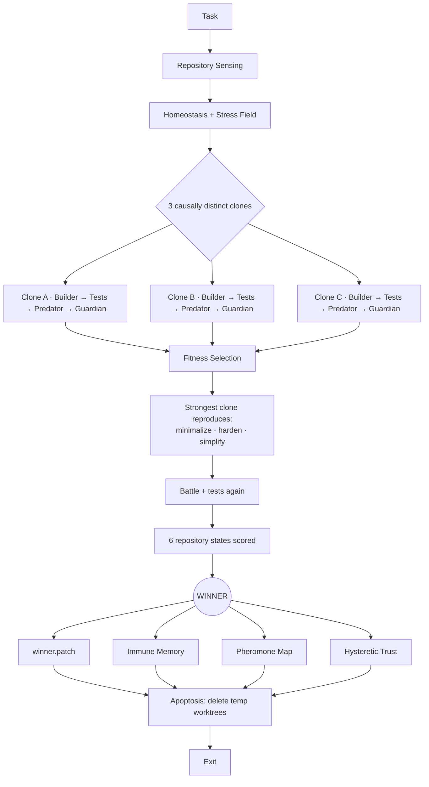

<div align="center">


<br/>

[](morph_system/LICENSE)
[](morph_system/VERSION)
[](#requirements)
[](#what-a-run-actually-does)
[](#requirements)

**Code that heals before it breaks.**

</div>

---

MORPH is a one-shot, multi-agent coding harness for Claude Code and Codex. It does **not** run as a background service. A single invocation runs one full evolutionary lifecycle — sense the repo, grow independent repair candidates in isolated git worktrees, battle-test them, select a winner by executable evidence, and exit.

## Table of contents

- [Requirements](#requirements)
- [Quick start](#quick-start)
- [What a run actually does](#what-a-run-actually-does)
- [CLI modes](#cli-modes)
- [Configuration](#configuration)
- [Adapters](#adapters)
- [Run artifacts](#run-artifacts)
- [Repository layout](#repository-layout)
- [Security model](#security-model)
- [Verifying this release](#verifying-this-release)
- [Scope of v0.1](#scope-of-v01)
- [License](#license)

## Requirements

- Python 3.9+ (standard library only — MORPH itself has zero Python dependencies)
- `git` with worktree support
- One of: [Claude Code](https://claude.com/claude-code) (`claude` on `PATH`, logged in) or [Codex](https://openai.com/codex/) (`codex` on `PATH`, logged in) — or neither, to use `--adapter mock` for dry-running MORPH itself

## Quick start

Extract this repository's contents into the root of the target git repo (already done here), then install:

```bash
bash morph_system/install.sh
```

Check prerequisites (git, Python, and whether `claude`/`codex` are on `PATH`):

```bash
./morph-once doctor
```

Then run a real one-shot lifecycle:

```bash
./morph-once --adapter claude --apply "YOUR TASK HERE"
```

Codex instead of Claude Code:

```bash
./morph-once --adapter codex --apply "YOUR TASK HERE"
```

Auto-detect Claude Code, falling back to Codex:

```bash
./morph-once --adapter auto --apply "YOUR TASK HERE"
```

Claude Code is driven through its non-interactive `claude -p` print mode; Codex is driven through `codex exec --ephemeral` with `workspace-write` / `read-only` sandboxing. See [`morph_system/README.md`](morph_system/README.md) for the full adapter reference.

## What a run actually does



Every run is a single pass through this graph — no daemon, no persistent process, nothing left running after `EXIT`.

## CLI modes

| Flag | Effect |
|---|---|
| *(none)* | Run, select a winner, write patch + report. **Base working tree is never touched.** |
| `--apply` | Apply the winner to the base tree, leave it uncommitted. Recommended for getting started. |
| `--commit` | Apply + local commit. Only the winner's own changed files are staged — never MORPH's install files or unrelated ignored artifacts. |
| `--push` | Apply + commit + push. The only mode that touches the remote. |
| `--keep-worktrees` | Debug only — skips apoptosis cleanup. |

`./morph-once doctor` checks prerequisites instead of running a lifecycle.

MORPH refuses to apply/commit/push onto a dirty base working tree, so a selected repair is never mixed with unrelated local changes.

### Selection gates

A winner is only ever applied if **all** of these hold — a failing test hard-blocks apply/commit/push even if the fitness score alone would have passed:

| Gate | Meaning |
|---|---|
| `fitness_ok` | Weighted score ≥ `fitness_threshold`. |
| `checks_ok` | Every executed test/lint/build command passed (`require_all_checks_pass`). |
| `predator_ok` | Adversarial-review severity ≤ `max_predator_severity`. |
| `guardian_ok` | Compatibility/minimality-review severity ≤ `max_guardian_severity`. |

`result.json` reports each gate individually under `selection_gates`, plus `checks_executed`.

## Configuration

`morph.yaml` (generated at the repo root by `install.sh`) is JSON-formatted YAML, parsed with the Python standard library only:

```json
{
  "clones": 3,
  "fitness_threshold": 0.45,
  "test_commands": ["npm test"],
  "predator_commands": ["npm run fuzz", "npm run test:integration"]
}
```

If `test_commands` is left empty, MORPH auto-detects common Node, Python, Go, Rust, Maven, and Gradle checks. Fitness weighs execution results, adversarial (Predator) review, Guardian review, minimality, blast radius, dependency stability, and task signal — see `homeostasis` in `morph.yaml` to tune the balance.

## Adapters

| Adapter | Backing CLI | Builder sandbox | Predator / Guardian |
|---|---|---|---|
| `claude` | `claude -p` (non-interactive, no session persistence) | file read/edit tools only | read-only |
| `codex` | `codex exec` | `workspace-write` | `read-only`, non-interactive approval |
| `mock` | none (built-in) | in-process | in-process — used for smoke-testing MORPH itself |
| `auto` | detects `claude`, then falls back to `codex` | — | — |

## Run artifacts

Each invocation writes a complete, inspectable trail:

```text
.morph/runs/<run-id>/
├── sensing.json
├── g0-candidate-1.json / .patch
├── g0-candidate-2.json / .patch
├── g0-candidate-3.json / .patch
├── g1-candidate-1.json / .patch
├── g1-candidate-2.json / .patch
├── g1-candidate-3.json / .patch
├── winner.patch
└── result.json

.morph/memory/
├── antibodies.json   # immune memory
├── pheromones.json   # decaying file-risk traces
└── trust.json        # hysteretic trust
```

Both directories are gitignored by default (see `.gitignore`).

## Repository layout

```text
.
├── README.md              ← you are here
├── START-MORPH.txt        ← copy-paste quick start
├── CHECKSUMS.txt          ← SHA-256 manifest for this release
├── morph.yaml             ← per-repo config, generated by install.sh
├── morph-once             ← generated CLI wrapper, generated by install.sh
└── morph_system/          ← vendored MORPH package
    ├── README.md          ← full reference documentation
    ├── ARCHITECTURE.md    ← design invariant + ASCII pipeline diagram
    ├── SECURITY.md        ← security model
    ├── LICENSE            ← MIT
    ├── VERSION
    ├── install.sh / doctor.sh / run-once.sh
    ├── morph/             ← implementation (adapters, colony, core, ci, git, memory)
    └── tests/             ← pytest smoke + unit tests
```

## Security model

- Temporary repair candidates live in isolated `git worktree` clones, force-cleaned in a `finally` path.
- The Claude Builder gets scoped file tools (`Read`/`Edit`/`Write`/`Glob`/`Grep`), never unrestricted shell access; Predator and Guardian are read-only.
- The Codex Builder runs under `workspace-write`; reviews run under `read-only` with non-interactive approval.
- MORPH itself only executes verification commands it auto-detected from project manifests or that you explicitly configured in `morph.yaml`.
- Nothing is pushed unless you pass `--push`.
- Apply/commit/push all refuse to run against a dirty base tree.

Full details in [`morph_system/SECURITY.md`](morph_system/SECURITY.md). Treat any repository's test/build scripts as executable code — review third-party repositories before running an autonomous coding agent against them.

## Verifying this release

```bash
sha256sum -c CHECKSUMS.txt
```

Vendor release checksum (v0.1.1 ZIP as shipped): `ae967daca0518ddddf0be7c033c8a51c41d6c5e00356340c2f21ec82c8ecf912`

> **Local fix on top of the vendor release:** the shipped `claude` adapter builds `claude -p --tools <list> <prompt>`. Against the real `claude` CLI, `--tools` is variadic and greedily consumes the next argv token — including the prompt — leaving `claude -p` with no prompt at all. Verified live against the actual `claude` binary in this environment and fixed in [`morph_system/morph/adapters/claude.py`](morph_system/morph/adapters/claude.py) by inserting an explicit `--` before the prompt, with a regression test in [`morph_system/tests/test_claude_adapter.py`](morph_system/tests/test_claude_adapter.py). Because `CHECKSUMS.txt` documents the vendor's original release, `claude.py` and the new test file no longer match their listed hashes — that mismatch is this fix, not corruption.

**End-to-end verification performed in this repo:**
- All 5 bundled tests pass (`pytest morph_system/tests`, `bash morph_system/run-tests.sh`).
- `./morph-once doctor` — correct JSON, exit 0.
- Full mock-adapter lifecycle (`--adapter mock`) — winner selected, all gates `true`, no residue after apoptosis.
- Hard safety gate — a deliberately failing test command produced `checks_ok: false`, `status: no-winner-verification-failed`, `applied: false`, exit code 3.
- **Real `claude -p` adapter**, live against this environment's actual `claude` CLI (reduced to a single clone to limit cost) — Builder wrote a real patch, Predator/Guardian produced real adversarial/compatibility review findings, gates all `true`, base working tree untouched (no `--apply`).
- `.morph-worktrees/` fully removed after every run — no empty leftover directories.
- `codex` was **not** available in this environment (no authenticated CLI installed), so the Codex adapter and `--ephemeral` flag are verified by code review against the adapter contract only, not a live run.

## Scope of v0.1

This is an executable research-grade foundation, not a claim that every biological metaphor is already a learned model. The stress field is a lightweight static import graph, predictive CI is represented by risk-weighted verification hooks rather than a trained predictor, and clonal evolution currently spans causal hypotheses rather than repeated mutation generations. The architecture is intentionally modular so each of these can be upgraded later without changing the one-shot CLI contract.

## License

MIT — see [`morph_system/LICENSE`](morph_system/LICENSE).

<div align="center">
<sub> Built for one-shot, evidence-based repair — not another background agent.</sub>
</div>
