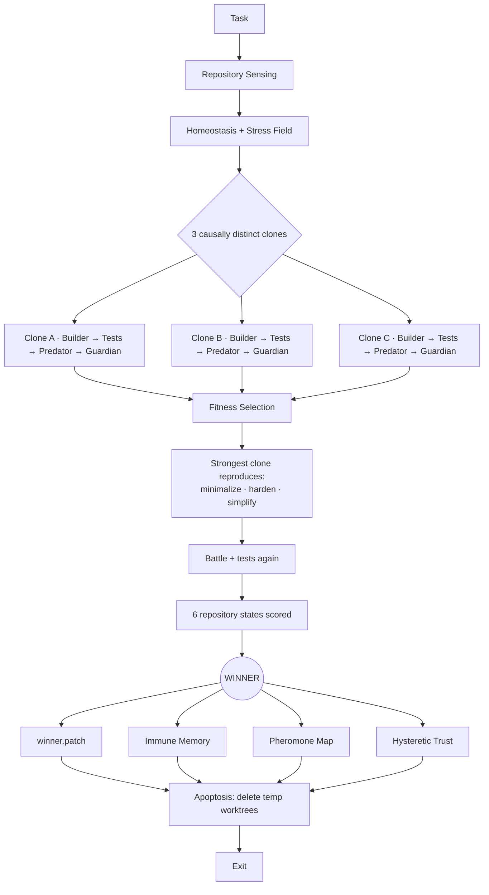

<div align="center">


<br/>

[](morph_system/LICENSE)
[](morph_system/VERSION)
[](#requirements)
[](#what-a-run-actually-does)
[](#requirements)

**Code that heals before it breaks.**

[Landing page](https://beko2210.github.io/morph/) · [source](site/index.html)

</div>

---

MORPH is a one-shot, multi-agent coding harness for Claude Code and Codex. It does **not** run as a background service. A single invocation runs one full evolutionary lifecycle — sense the repo, grow independent repair candidates in isolated git worktrees, battle-test them, select a winner by executable evidence, and exit.

## Table of contents

- [Requirements](#requirements)
- [Quick start](#quick-start)
- [What a run actually does](#what-a-run-actually-does)
- [CLI modes](#cli-modes)
- [Configuration](#configuration)
- [Adapters](#adapters)
- [Run artifacts](#run-artifacts)
- [Repository layout](#repository-layout)
- [Security model](#security-model)
- [Verifying this release](#verifying-this-release)
- [Scope of v0.1](#scope-of-v01)
- [License](#license)

## Requirements

- Python 3.9+ (standard library only — MORPH itself has zero Python dependencies)
- `git` with worktree support
- One of: [Claude Code](https://claude.com/claude-code) (`claude` on `PATH`, logged in) or [Codex](https://openai.com/codex/) (`codex` on `PATH`, logged in) — or neither, to use `--adapter mock` for dry-running MORPH itself

## Quick start

Extract this repository's contents into the root of the target git repo (already done here), then install:

```bash
bash morph_system/install.sh
```

Check prerequisites (git, Python, and whether `claude`/`codex` are on `PATH`):

```bash
./morph-once doctor
```

Then run a real one-shot lifecycle:

```bash
./morph-once --adapter claude --apply "YOUR TASK HERE"
```

Codex instead of Claude Code:

```bash
./morph-once --adapter codex --apply "YOUR TASK HERE"
```

Auto-detect Claude Code, falling back to Codex:

```bash
./morph-once --adapter auto --apply "YOUR TASK HERE"
```

Claude Code is driven through its non-interactive `claude -p` print mode; Codex is driven through `codex exec --ephemeral` with `workspace-write` / `read-only` sandboxing. See [`morph_system/README.md`](morph_system/README.md) for the full adapter reference.

## What a run actually does



Every run is a single pass through this graph — no daemon, no persistent process, nothing left running after `EXIT`.

## CLI modes

| Flag | Effect |
|---|---|
| *(none)* | Run, select a winner, write patch + report. **Base working tree is never touched.** |
| `--apply` | Apply the winner to the base tree, leave it uncommitted. Recommended for getting started. |
| `--commit` | Apply + local commit. Only the winner's own changed files are staged — never MORPH's install files or unrelated ignored artifacts. |
| `--push` | Apply + commit + push. The only mode that touches the remote. |
| `--keep-worktrees` | Debug only — skips apoptosis cleanup. |
| `--verbose` / `-v` | Also echo raw agent/check output live on stderr, not just `[MORPH] ...` progress lines. |

`./morph-once doctor` checks prerequisites instead of running a lifecycle.

Every run streams `[MORPH] ...` progress (sensing, hypothesis generation, Builder start/done, each check command, Predator/Guardian start/done, cleanup) to **stderr** and `run_dir/progress.log` as it happens — stdout is reserved for the final JSON result so scripts/CI can pipe it straight into `jq` or similar.

MORPH refuses to apply/commit/push onto a dirty base working tree, so a selected repair is never mixed with unrelated local changes.

### Selection gates

A winner is only ever applied if **all** of these hold — a failing test hard-blocks apply/commit/push even if the fitness score alone would have passed:

| Gate | Meaning |
|---|---|
| `fitness_ok` | Weighted score ≥ `fitness_threshold`. |
| `checks_ok` | Every executed test/lint/build command passed (`require_all_checks_pass`). |
| `predator_ok` | Adversarial-review severity ≤ `max_predator_severity`. |
| `guardian_ok` | Compatibility/minimality-review severity ≤ `max_guardian_severity`. |

`result.json` reports each gate individually under `selection_gates`, plus `checks_executed`.

## Configuration

`morph.yaml` (generated at the repo root by `install.sh`) is JSON-formatted YAML, parsed with the Python standard library only:

```json
{
  "clones": 3,
  "fitness_threshold": 0.45,
  "test_commands": ["npm test"],
  "predator_commands": ["npm run fuzz", "npm run test:integration"]
}
```

If `test_commands` is left empty, MORPH auto-detects common Node, Python, Go, Rust, Maven, and Gradle checks. Fitness weighs execution results, adversarial (Predator) review, Guardian review, minimality, blast radius, dependency stability, and task signal — see `homeostasis` in `morph.yaml` to tune the balance.

Resilience knobs (with defaults): `agent_max_retries` (2) and `agent_retry_backoff_s` (5.0) bound how often a **transient** transport error (dropped websocket, connection reset, 5xx) during an agent call is retried with exponential backoff — normal agent/task failures are never retried. `progress_heartbeat_s` (20) controls how often a silent, still-running agent call prints a heartbeat.

## Adapters

| Adapter | Backing CLI | Builder sandbox | Predator / Guardian |
|---|---|---|---|
| `claude` | `claude -p` (non-interactive, no session persistence) | file read/edit tools only | read-only |
| `codex` | `codex --ask-for-approval never exec --ephemeral` | `workspace-write` | `read-only`, non-interactive approval |
| `mock` | none (built-in) | in-process | in-process — used for smoke-testing MORPH itself |
| `auto` | detects `claude`, then falls back to `codex` | — | — |

## Run artifacts

Each invocation writes a complete, inspectable trail:

```text
.morph/runs/<run-id>/
├── sensing.json
├── progress.log                          # every "[MORPH] ..." line from this run
├── hypotheses.log                        # raw hypothesis-generation agent output
├── g0-candidate-1.json                   # journaled atomically per phase — never only written at the end
├── g0-candidate-1.patch
├── g0-candidate-1.builder.log
├── g0-candidate-1.checks.json
├── g0-candidate-1.predator.log
├── g0-candidate-1.guardian.log
├── g0-candidate-2.* / g0-candidate-3.* / g1-candidate-*.* (same shape)
├── winner.patch
├── result.json                           # written on every controlled exit path, including failures
└── error.json                            # present only if the run hit an unexpected exception

.morph/memory/
├── antibodies.json   # immune memory
├── pheromones.json   # decaying file-risk traces
└── trust.json        # hysteretic trust
```

Each `g*-candidate-N.json` is updated after worktree creation, after the Builder finishes, after each check command, and after each review — so a crash mid-run (network drop, killed process) still leaves whatever phases completed on disk instead of losing the candidate entirely. A Builder call that produces an empty diff is journaled as `"status": "builder-no-change"` and is excluded from review and fitness-based selection rather than being scored like a normal candidate. A persistently broken Predator/Guardian review (retries exhausted) degrades that candidate to maximum severity with a traceable finding instead of aborting the whole run.

Both `.morph/` and `.morph-worktrees/` are gitignored by default (see `.gitignore`).

## Repository layout

```text
.
├── README.md              ← you are here
├── START-MORPH.txt        ← copy-paste quick start
├── CHECKSUMS.txt          ← SHA-256 manifest for this release
├── morph.yaml             ← per-repo config, generated by install.sh
├── morph-once             ← generated CLI wrapper, generated by install.sh
└── morph_system/          ← vendored MORPH package
    ├── README.md          ← full reference documentation
    ├── ARCHITECTURE.md    ← design invariant + ASCII pipeline diagram
    ├── SECURITY.md        ← security model
    ├── LICENSE            ← MIT
    ├── VERSION
    ├── install.sh / doctor.sh / run-once.sh
    ├── morph/             ← implementation (adapters, colony, core, ci, git, memory)
    └── tests/             ← pytest smoke + unit tests
```

## Security model

- Temporary repair candidates live in isolated `git worktree` clones, force-cleaned in a `finally` path.
- The Claude Builder gets scoped file tools (`Read`/`Edit`/`Write`/`Glob`/`Grep`), never unrestricted shell access; Predator and Guardian are read-only.
- The Codex Builder runs under `workspace-write`; reviews run under `read-only` with non-interactive approval.
- MORPH itself only executes verification commands it auto-detected from project manifests or that you explicitly configured in `morph.yaml`.
- Nothing is pushed unless you pass `--push`.
- Apply/commit/push all refuse to run against a dirty base tree.

Full details in [`morph_system/SECURITY.md`](morph_system/SECURITY.md). Treat any repository's test/build scripts as executable code — review third-party repositories before running an autonomous coding agent against them.

## Verifying this release

```bash
sha256sum -c CHECKSUMS.txt
```

Vendor release checksum (v0.1.1 ZIP as shipped): `ae967daca0518ddddf0be7c033c8a51c41d6c5e00356340c2f21ec82c8ecf912`

> **Local fixes on top of the vendor release** (`CHECKSUMS.txt` documents the vendor's original v0.1.1 release; several files below intentionally no longer match their listed hashes because of these fixes, not corruption):
>
> 1. The `claude` adapter built `claude -p --tools <list> <prompt>`. Against the real `claude` CLI, `--tools` is variadic and greedily consumes the next argv token — including the prompt — leaving `claude -p` with no prompt at all. Verified live against the actual `claude` binary. Fixed in [`morph_system/morph/adapters/claude.py`](morph_system/morph/adapters/claude.py) with an explicit `--` before the prompt.
> 2. The `codex` adapter built `codex exec --ask-for-approval never ...`, but `--ask-for-approval` is a **global** codex option (codex ≥ 0.147 rejects it after `exec` with `unexpected argument '--ask-for-approval' found`). Found in a real run against an external target repo with codex 0.147.0. Fixed in [`morph_system/morph/adapters/codex.py`](morph_system/morph/adapters/codex.py) by moving it before `exec`.
> 3. `subprocess.run(capture_output=True)` buffered all agent/check output until process exit — a run could sit silent for minutes with no visible phase, candidate, or heartbeat. Fixed with `util.run_streamed`/`util.run_agent`: real-time output teed to a log file plus periodic heartbeats, and `[MORPH] ...` progress lines on stderr for every phase (stdout stays pure JSON).
> 4. A transient network error (dropped websocket, connection reset, 5xx) during a single Predator/Guardian call aborted the *entire* run, discarding already-completed Builder/test work. Fixed with bounded retry-with-backoff for clearly transient transport errors only (`util.is_transient_error`), plus graceful per-candidate degradation (`_safe_review`) if a review still fails after retries — the candidate is scored maximally severe and excluded, not the whole run crashed.
> 5. Candidate artifacts were only written after Builder + Checks + Predator + Guardian *all* finished, so a mid-run crash left only `sensing.json`. Fixed: `orchestrator._evaluate` now journals each candidate atomically per phase, and `result.json` (status `run-failed`) + `error.json` (with traceback) are now written on every controlled exit path, including unexpected exceptions, before worktree cleanup runs.
> 6. An empty Builder diff was silently reviewed and fitness-scored like a normal candidate. Fixed: it's now journaled as an explicit `"status": "builder-no-change"` and excluded from review and winner/parent selection.
> 7. `sensing.json`'s `git_clean` could read `0.0` (dirty) even when only MORPH's own untracked artifacts (`.morph/`, `morph.yaml`, ...) were present — `homeostasis.sense()` now filters `git status --porcelain` through the same `ignore_paths` the apply-safety check already used.
>
> Issues 2–7 were found via a real end-to-end MORPH run against an external target repository (codex 0.147.0); issue 1 against this environment's real `claude` CLI. 12 new regression tests cover all of them.
>
> **v0.1.3, found via a second real end-to-end run (autonomous, then a manual worktree audit):**
> 8. `filter_ignored_status`'s file-pattern matching used `startswith`, so an ignore_paths entry like `"morph.yaml"` (no trailing slash, meant as an exact filename) also incorrectly matched unrelated project files sharing that prefix, e.g. `morph.yaml.backup`. Fixed to require exact equality for non-directory patterns; only `"..."/ "`-suffixed directory patterns still use prefix matching.
> 9. `run_streamed` never closed the subprocess's `stdout` pipe, leaking a file descriptor (and a `ResourceWarning`) per agent/check call. Fixed with an explicit `close()` in the `finally` block.
> 10. **Candidate worktrees had no `node_modules`/`.venv`.** `git worktree add` only checks out tracked files, so a fresh candidate clone for a Node/Python project starts without its installed dependencies — any check command that needs them (`npm run lint`, `npm run build`, ...) would fail with "command not found" regardless of how correct the patch is, unless the Builder happened to install something itself as a side effect (which is what silently saved the very first real run below). `WorktreeManager.create()` now symlinks `node_modules`/`.venv`/`venv` in from the base repo when present.
>
> 21 tests total (`pytest morph_system/tests`, `bash morph_system/run-tests.sh`).

> **v0.1.9 — landing page fixes (found via a real phone screenshot) and a CLI footgun (found while testing the agent end-to-end):**
> 11. The "what a run actually does" section on the landing page was a flat 5-card list — it didn't actually show the fan-out into 3 causally-distinct clones, the mutation-and-rebattle step, or the 6-state scoring gate the README describes. Replaced with a real SVG pipeline diagram (`site/index.html`) tracing Task → Sensing → 3 clones (Builder → Tests → Predator → Guardian each) → Fitness Selection → Reproduce (minimalize/harden/simplify) → battle again → 6 states scored → Winner → 4 artifacts → Apoptosis → Exit.
> 12. Decorative `.glow` background blobs use negative offsets (`left:-160px`, `right:-140px`) to bleed off the edge of their section, but the generic `.section` class had no `overflow:hidden` (only `.hero` did) — combined with `overflow-x:hidden` set on `body` but not `html`, the page could pan horizontally on mobile, revealing unstyled space past the site's right edge. Found via a live screenshot on a phone against the deployed page. Fixed both: `overflow:hidden` added to `.section`, `overflow-x:hidden` plus an explicit background added to `html`.
> **v0.1.10 — the landing page now shows a real run instead of describing one:**
> 14. The landing page had no evidence a run had ever happened — only prose claiming it did, plus two stale figures (`21/21 tests pass`, and a `doctor` description predating v0.1.7's human-readable output). Added a **replay of one real recorded run** (`site/index.html`, section `#replay`): all 6 candidates, their real hypothesis names, builder seconds, Predator/Guardian severity and confidence, finding counts and fitness scores, played back against the run's own `progress.log` timeline. Every displayed figure is asserted equal to the values in that run's candidate JSON — the numbers are extracted from `.morph/runs/`, not written by hand. Review durations come from the run's 20s progress heartbeats and are used only to pace the replay, never displayed as precise values. Honors `prefers-reduced-motion` by rendering the finished state instead of animating.
> 15. The nine feature icons were stock stroke icons that named their section rather than depicting it — a clock for "no daemon", a refresh arrow for "zero dependencies", and the *same* shield path for both "Evidence, not vibes" and "Guardian compatibility gate". Redrawn so each one shows the mechanism: a single burst against a hard stop, a sealed core with nothing linked across its boundary, three measurements against a threshold line, a fan-out with the winner filled in, a magnifier over a fault trace, one arrow through the gate and one blocked, an intensifying trail to a marked target, a solid source beside three dashed throwaway worktrees, and two adapters merging into one lifecycle.
> 16. The hero was a static image of three strands converging. It is now rendered live on a canvas — three helices at a converging radius, drawn through a real perspective projection with a slow camera yaw so the convergence point parallaxes, additively blended, no library. The still image stays in the markup as the fallback and is what you keep under `prefers-reduced-motion` or without canvas. Verified headlessly: 61fps, pauses off-screen and on tab hide, and the reduced-motion path never starts the animation at all.
>
> 13. **`./morph-once run <task>` silently ran the wrong task.** The wrapper already supplies the `run` subcommand, but `./morph-once --help` rendered as `usage: morph run [-h] ... task` — telling users to type a `run` that was already there. Doing so made argparse bind the literal word `"run"` to the task positional: with a task string present it was rejected as `unrecognized arguments: <your actual task>`, and bare `./morph-once run` started a **complete real lifecycle** (3 clones + 3 evolution children against the live adapter) whose task was the string `"run"`. Reproduced end-to-end: the pre-fix wrapper ran for 61s and exited 0 on a nonsense task. Fixed in [`morph-once`](morph-once) (tolerate a redundant leading `run`) and [`morph_system/morph/cli.py`](morph_system/morph/cli.py) (`MORPH_PROG`, so the wrapper's help reads `usage: morph-once ...`). 4 regression tests, verified non-vacuous against the pre-fix tree.

**End-to-end verification performed in this repo:**
- All 21 tests pass.
- `./morph-once doctor` — correct JSON, exit 0.
- Full mock-adapter lifecycle (`--adapter mock`) — winner selected, all gates `true`, no residue after apoptosis.
- Hard safety gate — a deliberately failing test command produced `checks_ok: false`, `status: no-winner-verification-failed`, `applied: false`, exit code 3.
- **Real `claude -p` adapter**, live against this environment's actual `claude` CLI (reduced to a single clone to limit cost) — Builder wrote a real patch, Predator/Guardian produced real adversarial/compatibility review findings, gates all `true`, base working tree untouched (no `--apply`).
- `.morph-worktrees/` fully removed after every run — no empty leftover directories, including on the exception path.
- `codex` was **not** available in this environment (no authenticated CLI installed), so the `codex` arg-order fix is verified by code review against the reported error plus a regression test, not a live codex run.

## Scope of v0.1

This is an executable research-grade foundation, not a claim that every biological metaphor is already a learned model. The stress field is a lightweight static import graph, predictive CI is represented by risk-weighted verification hooks rather than a trained predictor, and clonal evolution currently spans causal hypotheses rather than repeated mutation generations. The architecture is intentionally modular so each of these can be upgraded later without changing the one-shot CLI contract.

## License

MIT — see [`morph_system/LICENSE`](morph_system/LICENSE).

<div align="center">
<sub> Built for one-shot, evidence-based repair — not another background agent.</sub>
</div>
